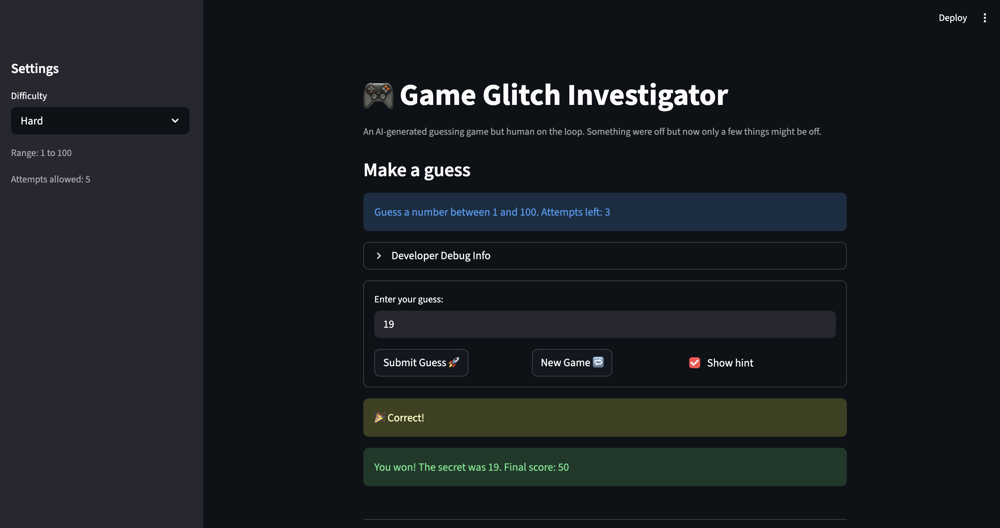
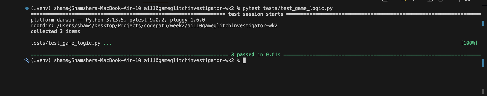

# 🎮 Game Glitch Investigator: The Impossible Guesser

## 🚨 The Situation

You asked an AI to build a simple "Number Guessing Game" using Streamlit.
It wrote the code, ran away, and now the game is unplayable. 

- You can't win.
- The hints lie to you.
- The secret number seems to have commitment issues.

## 🛠️ Setup

1. Install dependencies: `pip install -r requirements.txt`
2. Run the broken app: `python -m streamlit run app.py`

## 🕵️‍♂️ Your Mission

1. **Play the game.** Open the "Developer Debug Info" tab in the app to see the secret number. Try to win.
2. **Find the State Bug.** Why does the secret number change every time you click "Submit"? Ask ChatGPT: *"How do I keep a variable from resetting in Streamlit when I click a button?"*
3. **Fix the Logic.** The hints ("Higher/Lower") are wrong. Fix them.
4. **Refactor & Test.** - Move the logic into `logic_utils.py`.
   - Run `pytest` in your terminal.
   - Keep fixing until all tests pass!

## 📝 Document Your Experience

- The purpose of the game

The purpose of this game is to have the user guess the secret number in a given number of attemps. There is hints available too.

- Bugs found:

   - The difficult levels were mismatched.
   - The hints were backward; instead of 'go lower', it would say 'go higher' and vice versa.
   - The 'new game' button didn't do anything to remove the 'Game Over' signal.
   - The 'new game' would choose a secret from 1 to 100 regardless of the difficulty selected.

- Bug fixes
   - I wrote some tests
   - Fixed the difficulty level mismatch.
   - Fixed the backward hint bug.
   - Fix the UI problem with the new game button.
   - Fixed the secret generation bug associated with new game secret generation.

## 📸 Demo

